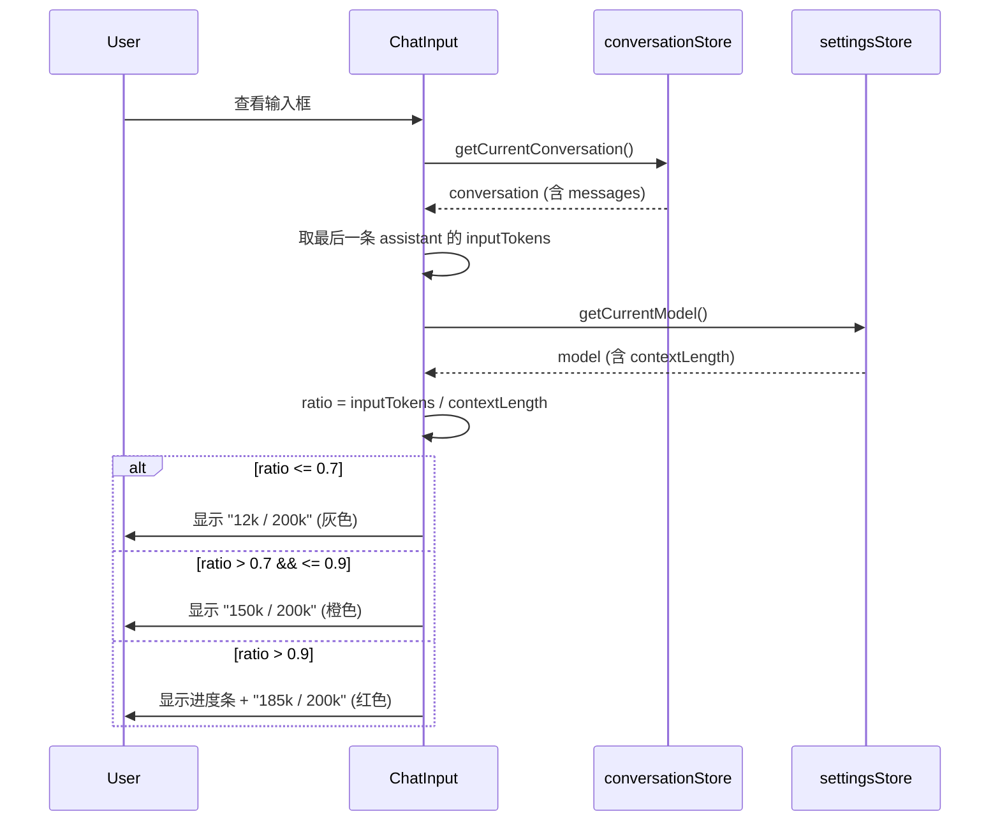
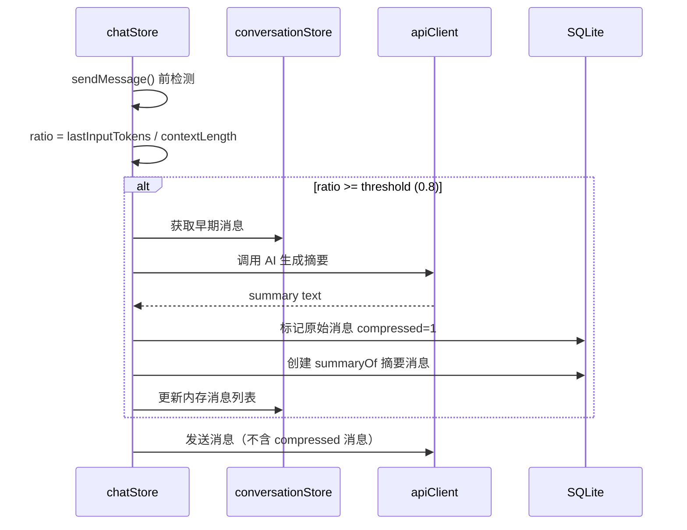

# 详细设计: 上下文管理 & 自动压缩

> 日期: 2026-02-11
> 优先级: P1 (上下文显示) / P2 (自动压缩)
> PRD 来源: docs/2026-02-11-token-context-workspace-prd.md (功能二)

---

## 1. 概述

本设计覆盖两个子功能:
1. **上下文使用量显示** (P1) — 在聊天输入框工具栏显示当前上下文占用比例
2. **自动压缩上下文** (P2) — 当上下文接近上限时，自动用 AI 摘要替换早期消息

依赖关系: 上下文显示依赖 Token 统计功能（Task #1）提供的 `inputTokens` 数据。

---

## 2. 前置依赖

- **Token 统计功能已实现**: messages 表已有 `input_tokens` 字段，AIStreamChunk 已携带 usage
- **models 表已有 `contextLength` 字段**: 当前为 nullable，需补充默认值映射

---

## 3. Model Context Length 配置

### 3.1 内置默认值映射表

**新增文件**: `src/shared/constants/modelDefaults.ts`

```typescript
/**
 * 内置模型的默认 context length 映射
 * 匹配规则: modelId 前缀匹配，优先精确匹配
 */
export const MODEL_CONTEXT_DEFAULTS: Array<{
  pattern: string | RegExp
  contextLength: number
}> = [
  { pattern: /^claude-sonnet-4-/, contextLength: 200_000 },
  { pattern: /^claude-opus-4-/, contextLength: 200_000 },
  { pattern: /^claude-haiku-3\.5-/, contextLength: 200_000 },
  { pattern: /^claude-3-/, contextLength: 200_000 },
  { pattern: /^gpt-4\.1/, contextLength: 1_047_576 },
  { pattern: /^gpt-4o/, contextLength: 128_000 },
  { pattern: /^gpt-4-turbo/, contextLength: 128_000 },
  { pattern: /^o[134]/, contextLength: 200_000 },
  { pattern: /^gemini-2\.[05]-/, contextLength: 1_048_576 },
  { pattern: /^deepseek-chat$/, contextLength: 64_000 },
  { pattern: /^deepseek-reasoner$/, contextLength: 64_000 },
  { pattern: /^moonshot-v1-8k$/, contextLength: 8_000 },
  { pattern: /^moonshot-v1-32k$/, contextLength: 32_000 },
  { pattern: /^moonshot-v1-128k$/, contextLength: 128_000 },
]

export function getDefaultContextLength(
  modelId: string
): number | null {
  for (const entry of MODEL_CONTEXT_DEFAULTS) {
    if (entry.pattern instanceof RegExp) {
      if (entry.pattern.test(modelId)) return entry.contextLength
    } else if (modelId.startsWith(entry.pattern)) {
      return entry.contextLength
    }
  }
  return null
}
```

### 3.2 模型创建/导入时自动匹配

**文件**: `src/main/db/services/modelService.ts`

在模型创建时，如果 `contextLength` 未提供，自动从映射表查找:

```typescript
import { getDefaultContextLength } from '@shared/constants/modelDefaults'

static async create(data: Omit<NewModel, 'id'> & { id?: string }) {
  const db = getDatabase()
  const newModel: NewModel = {
    id: data.id || generateId(),
    providerId: data.providerId,
    modelId: data.modelId,
    name: data.name,
    // 自动匹配默认 contextLength
    contextLength: data.contextLength ?? getDefaultContextLength(data.modelId),
    isCustom: data.isCustom || false,
    enabled: data.enabled ?? true,
  }
  await db.insert(models).values(newModel)
  return newModel
}
```

---

## 4. 上下文使用量显示 (P1)

### 4.1 数据来源

上下文使用量 = 上一次 API 返回的 `input_tokens`（即当前对话发送给 AI 的总 token 数）。

获取方式: 从当前对话最后一条 assistant 消息的 `inputTokens` 字段读取。

### 4.2 ContextIndicator 组件（新增）

**文件**: `src/renderer/src/components/chat/ContextIndicator.tsx`

```typescript
interface ContextIndicatorProps {
  usedTokens: number | null
  contextLength: number | null
}

export function ContextIndicator({
  usedTokens,
  contextLength,
}: ContextIndicatorProps) {
  if (!usedTokens || !contextLength) return null

  const ratio = usedTokens / contextLength
  const usedDisplay = formatTokenShort(usedTokens)
  const totalDisplay = formatTokenShort(contextLength)

  // 状态判定
  const isWarning = ratio > 0.7
  const isCritical = ratio > 0.9

  if (isCritical) {
    return (
      <div className="flex items-center gap-1.5 px-2 py-1">
        <div className="w-16 h-1.5 rounded-full bg-[hsl(var(--surface-2))]">
          <div
            className="h-full rounded-full bg-red-500"
            style={{ width: `${Math.min(ratio * 100, 100)}%` }}
          />
        </div>
        <span className="text-xs text-red-500">
          {usedDisplay} / {totalDisplay}
        </span>
      </div>
    )
  }

  return (
    <span className={`text-xs px-2 py-1 ${
      isWarning
        ? 'text-orange-500'
        : 'text-[hsl(var(--text-muted))]'
    }`}>
      {usedDisplay} / {totalDisplay}
    </span>
  )
}
```

**辅助函数**:

```typescript
function formatTokenShort(count: number): string {
  if (count >= 1_000_000) return `${(count / 1_000_000).toFixed(1)}M`
  if (count >= 1_000) return `${Math.round(count / 1_000)}k`
  return String(count)
}
```

### 4.3 ChatInput 集成

**文件**: `src/renderer/src/components/chat/ChatInput.tsx`

在工具栏中 Thinking 按钮之后添加 ContextIndicator:

```typescript
import { ContextIndicator } from './ContextIndicator'

// 在 Toolbar 的 left section 末尾:
<ContextIndicator
  usedTokens={lastInputTokens}
  contextLength={currentModel?.contextLength ?? null}
/>
```

**数据获取**: 从当前对话最后一条 assistant 消息的 `inputTokens` 读取:

```typescript
const conversation = getCurrentConversation()
const lastAssistantMsg = conversation?.messages
  .filter((m) => m.role === 'assistant' && m.inputTokens)
  .at(-1)
const lastInputTokens = lastAssistantMsg?.inputTokens ?? null
```

---

## 5. 数据库 Schema 变更

### 5.1 messages 表新增字段（用于压缩）

```sql
ALTER TABLE messages ADD COLUMN compressed INTEGER DEFAULT 0;
ALTER TABLE messages ADD COLUMN summary_of TEXT;
```

### 5.2 Drizzle Schema 变更

**文件**: `src/main/db/schema.ts`

```typescript
// messages 表新增:
compressed: integer('compressed').default(0),
summaryOf: text('summary_of'),  // JSON array of compressed message IDs
```

### 5.3 Message 类型扩展

**文件**: `src/shared/types/conversation.ts`

```typescript
export interface Message {
  // ... 现有字段 ...
  // 新增（压缩相关）
  compressed?: boolean
  summaryOf?: string[]  // 被压缩的消息 ID 列表
}
```

### 5.4 Settings 新增配置项

**文件**: `src/renderer/src/stores/settingsStore.ts`

```typescript
// 新增 state:
contextCompressionEnabled: boolean  // 默认 true
contextCompressionThreshold: number // 默认 0.8
```

持久化到 settings 表:
- key: `contextCompressionEnabled`, value: `true`
- key: `contextCompressionThreshold`, value: `0.8`

---

## 6. 自动压缩上下文 (P2)

### 6.1 压缩触发条件

在 `chatStore.sendMessage` 中，发送消息前检测:

```typescript
const contextLength = currentModel?.contextLength
const lastInputTokens = /* 上一条 assistant 消息的 inputTokens */
const threshold = settingsStore.contextCompressionThreshold

if (
  contextLength &&
  lastInputTokens &&
  settingsStore.contextCompressionEnabled &&
  lastInputTokens / contextLength >= threshold
) {
  await compressContext(conversationId, contextLength)
}
```

### 6.2 压缩流程

```typescript
async function compressContext(
  conversationId: string,
  contextLength: number
): Promise<void> {
  const conversation = useConversationStore.getState().getCurrentConversation()
  if (!conversation) return

  const messages = conversation.messages.filter((m) => !m.compressed)

  // 保留 system prompt（第一条）和最近 N 条消息
  const KEEP_RECENT = 6 // 保留最近 6 条消息（3 轮对话）
  if (messages.length <= KEEP_RECENT + 1) return // 消息太少，无需压缩

  const toCompress = messages.slice(0, messages.length - KEEP_RECENT)

  // 构建压缩 prompt
  const compressPrompt = `请将以下对话历史压缩为简洁摘要，保留关键信息、决策和上下文：

${toCompress.map((m) => `[${m.role}]: ${m.content}`).join('\n\n')}

请输出一段简洁的摘要，涵盖所有重要信息。`

  // 调用 AI 生成摘要
  const summary = await apiClient.sendMessage(
    provider.type,
    [{ role: 'user', content: compressPrompt }],
    aiConfig
  )

  // 标记原始消息为 compressed
  const compressedIds = toCompress.map((m) => m.id)
  for (const id of compressedIds) {
    await dbClient.messages.updateCompressed(id, true)
  }

  // 创建摘要消息
  const summaryMessage = {
    id: uuidv4(),
    conversationId,
    role: 'assistant' as const,
    content: `[Context Summary]\n\n${summary}`,
    timestamp: new Date(toCompress[0].timestamp),
    compressed: false,
    summaryOf: JSON.stringify(compressedIds),
  }
  await dbClient.messages.create(summaryMessage)

  // 更新内存中的消息列表
  // ... 省略 state 更新逻辑
}
```

### 6.3 发送消息时过滤 compressed 消息

**文件**: `src/renderer/src/stores/chatStore.ts`

在构建 `historyMessages` 时，过滤掉 `compressed=true` 的消息:

```typescript
const historyMessages: AIMessage[] = await Promise.all(
  conversation.messages
    .filter((m) => !m.compressed) // 过滤已压缩消息
    .map(async (m) => {
      // ... 现有逻辑
    })
)
```

### 6.4 UI 中显示压缩提示

**文件**: `src/renderer/src/components/chat/CompressedSummary.tsx`（新增）

```typescript
interface CompressedSummaryProps {
  content: string
  compressedCount: number
}

export function CompressedSummary({
  content,
  compressedCount,
}: CompressedSummaryProps) {
  const [expanded, setExpanded] = useState(false)

  return (
    <div className="my-2 rounded-lg border border-dashed
      border-[hsl(var(--border))] p-3 text-sm
      text-[hsl(var(--text-muted))]">
      <button
        onClick={() => setExpanded(!expanded)}
        className="flex items-center gap-1.5 hover:text-foreground"
      >
        <span>{expanded ? '▼' : '▶'}</span>
        <span>已压缩 {compressedCount} 条早期消息</span>
      </button>
      {expanded && (
        <div className="mt-2 text-xs whitespace-pre-wrap">
          {content}
        </div>
      )}
    </div>
  )
}
```

---

## 7. 需要修改的文件清单

| 文件 | 改动类型 | 描述 |
|------|---------|------|
| `src/shared/constants/modelDefaults.ts` | **新增** | 内置模型 contextLength 映射表 |
| `src/main/db/schema.ts` | 修改 | messages 表新增 compressed、summaryOf 字段 |
| `src/main/db/services/modelService.ts` | 修改 | create 时自动匹配 contextLength |
| `src/main/db/services/messageService.ts` | 修改 | 新增 updateCompressed 方法 |
| `src/shared/types/conversation.ts` | 修改 | Message 接口增加 compressed、summaryOf |
| `src/renderer/src/components/chat/ContextIndicator.tsx` | **新增** | 上下文使用量显示组件 |
| `src/renderer/src/components/chat/CompressedSummary.tsx` | **新增** | 压缩摘要展示组件 |
| `src/renderer/src/components/chat/ChatInput.tsx` | 修改 | 集成 ContextIndicator |
| `src/renderer/src/components/chat/MessageItem.tsx` | 修改 | 渲染 CompressedSummary |
| `src/renderer/src/stores/chatStore.ts` | 修改 | 压缩触发逻辑、过滤 compressed 消息 |
| `src/renderer/src/stores/settingsStore.ts` | 修改 | 新增压缩配置项 |
| `src/renderer/src/stores/conversationStore.ts` | 修改 | loadConversation 映射新字段 |
| `src/renderer/src/components/layout/Settings.tsx` | 修改 | 新增压缩开关和阈值配置 |
| `drizzle/XXXX_add_context_compression.sql` | **新增** | DB migration |

---

## 8. 时序图

### 8.1 上下文使用量显示



### 8.2 自动压缩流程



---

## 9. BDD 验收标准

### 9.1 上下文使用量显示

```gherkin
Feature: 聊天输入框显示上下文使用量

  Scenario: 正常状态显示上下文占用
    Given 用户已配置模型且 contextLength 为 200000
    And 上一条 assistant 消息的 inputTokens 为 24000
    When 用户查看聊天输入框工具栏
    Then 应显示 "24k / 200k" 文字（灰色）

  Scenario: 警告状态（>70%）
    Given 模型 contextLength 为 200000
    And 上一条 assistant 消息的 inputTokens 为 150000
    When 用户查看聊天输入框工具栏
    Then 应显示 "150k / 200k" 文字（橙色）

  Scenario: 危险状态（>90%）
    Given 模型 contextLength 为 200000
    And 上一条 assistant 消息的 inputTokens 为 185000
    When 用户查看聊天输入框工具栏
    Then 应显示进度条 + "185k / 200k"（红色）

  Scenario: 无 token 数据时不显示
    Given 当前对话没有 assistant 消息或无 inputTokens 数据
    When 用户查看聊天输入框工具栏
    Then 不应显示上下文使用量指示器

  Scenario: 模型无 contextLength 时不显示
    Given 当前模型的 contextLength 为 null
    When 用户查看聊天输入框工具栏
    Then 不应显示上下文使用量指示器
```

### 9.2 Model Context Length 配置

```gherkin
Feature: 模型 contextLength 自动匹配

  Scenario: 创建内置模型时自动填充 contextLength
    Given 用户添加了一个 Claude provider
    When 导入模型 "claude-sonnet-4-20250514"
    Then 该模型的 contextLength 应自动设置为 200000

  Scenario: 自定义模型无匹配时 contextLength 为 null
    Given 用户添加了一个自定义 provider
    When 创建模型 "my-custom-model"
    And 未手动填写 contextLength
    Then 该模型的 contextLength 应为 null
```

### 9.3 自动压缩上下文

```gherkin
Feature: 上下文自动压缩

  Scenario: 上下文达到阈值时自动压缩
    Given 自动压缩已开启，阈值为 80%
    And 模型 contextLength 为 200000
    And 上一条 assistant 消息的 inputTokens 为 165000（82.5%）
    When 用户发送新消息
    Then 应自动触发压缩流程
    And 早期消息应被标记为 compressed=1
    And 应创建一条包含摘要的新消息
    And UI 应显示 "已压缩 N 条早期消息" 提示

  Scenario: 压缩后原始消息保留在 DB
    Given 已执行过一次上下文压缩
    When 查询 messages 表
    Then 被压缩的消息仍存在于数据库中
    And 其 compressed 字段为 1

  Scenario: 用户关闭自动压缩
    Given 用户在 Settings 中关闭了自动压缩
    And 上下文使用量超过 80%
    When 用户发送新消息
    Then 不应触发压缩流程
```

---

## 10. 边界情况与错误处理

1. **模型无 contextLength**: 如果当前模型的 contextLength 为 null，ContextIndicator 不渲染，压缩不触发
2. **压缩 AI 调用失败**: 如果摘要生成失败，跳过压缩，正常发送消息（降级为不压缩）
3. **消息过少**: 如果对话消息数 <= KEEP_RECENT + 1，不触发压缩
4. **并发压缩**: 通过 isLoading 状态防止并发发送，压缩在 sendMessage 内同步执行
5. **旧数据兼容**: compressed 字段默认为 0，旧消息不受影响

---

## 11. 测试要点

1. **getDefaultContextLength 单元测试**: 验证各模型 ID 的匹配结果
2. **ContextIndicator 组件测试**: 验证三种状态（正常/警告/危险）的渲染
3. **压缩流程集成测试**: 验证触发条件、摘要生成、消息标记、UI 更新
4. **Settings 配置测试**: 验证开关和阈值的持久化与生效
5. **消息过滤测试**: 验证 compressed 消息不被发送给 AI
