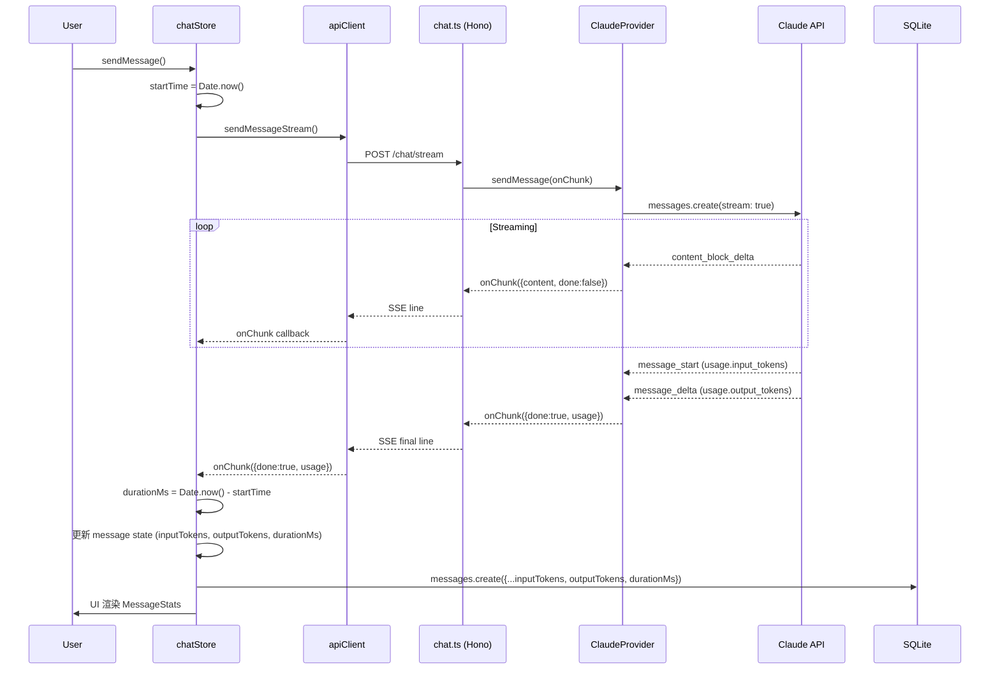

# 详细设计: Token 统计 + 耗时显示

> 日期: 2026-02-11
> 优先级: P0
> PRD 来源: docs/2026-02-11-token-context-workspace-prd.md (功能一 + 功能三)

---

## 1. 概述

本设计覆盖两个紧密关联的功能:
1. **Token 消耗统计** — 每条 assistant 消息显示 input/output tokens，Settings 中按模型汇总
2. **调用耗时显示** — 每条 assistant 消息底部显示本次 API 调用耗时

两者共享数据链路（streaming 结束时一并返回），因此合并设计。

---

## 2. 数据库 Schema 变更

### 2.1 messages 表新增字段

```sql
ALTER TABLE messages ADD COLUMN input_tokens INTEGER;
ALTER TABLE messages ADD COLUMN output_tokens INTEGER;
ALTER TABLE messages ADD COLUMN duration_ms INTEGER;
```

### 2.2 Drizzle Schema 变更

**文件**: `src/main/db/schema.ts`

```typescript
// 在 messages 表定义中新增:
export const messages = sqliteTable('messages', {
  // ... 现有字段 ...
  inputTokens: integer('input_tokens'),
  outputTokens: integer('output_tokens'),
  durationMs: integer('duration_ms'),
})
```

### 2.3 Migration 脚本

**文件**: `drizzle/XXXX_add_token_stats.sql`

```sql
ALTER TABLE messages ADD COLUMN input_tokens INTEGER;
ALTER TABLE messages ADD COLUMN output_tokens INTEGER;
ALTER TABLE messages ADD COLUMN duration_ms INTEGER;
```

> 注意: SQLite 的 ALTER TABLE ADD COLUMN 不支持在同一语句中添加多列，需分三条执行。
> 所有字段均为 nullable，不影响已有数据。

---

## 3. 类型定义变更

### 3.1 AIStreamChunk 扩展

**文件**: `src/shared/types/ai.ts`

```typescript
// 新增 usage 类型
export interface TokenUsage {
  inputTokens: number
  outputTokens: number
}

// 修改 AIStreamChunk
export interface AIStreamChunk {
  content: string
  done: boolean
  toolCall?: ToolCallData
  toolResult?: ToolResultData
  thinking?: string
  // 新增: 仅在 done=true 时携带
  usage?: TokenUsage
  durationMs?: number
}
```

### 3.2 Message 类型扩展

**文件**: `src/shared/types/conversation.ts`

```typescript
export interface Message {
  id: string
  role: 'user' | 'assistant'
  content: string
  timestamp: number
  toolCalls?: ToolCall[]
  toolResults?: ToolResult[]
  attachments?: AttachmentPreview[]
  thinking?: string
  // 新增
  inputTokens?: number
  outputTokens?: number
  durationMs?: number
}
```

---

## 4. Provider 层改动 — Token Usage 提取

### 4.1 BaseAIProvider 接口不变

`sendMessage` 签名保持不变。Usage 数据通过 `AIStreamChunk` 的 `done=true` 最终 chunk 传递，无需修改基类接口。

### 4.2 ClaudeProvider 改动

**文件**: `src/api/services/ai/providers/claude.ts`

**改动点**: `streamResponseWithTools` 方法

```typescript
// 新增实例变量跟踪累计 usage
let totalInputTokens = 0
let totalOutputTokens = 0

// 在 for await (const chunk of stream) 循环中新增分支:
} else if (chunk.type === 'message_start') {
  if (chunk.message?.usage) {
    totalInputTokens += chunk.message.usage.input_tokens || 0
  }
} else if (chunk.type === 'message_delta') {
  if (chunk.usage) {
    totalOutputTokens += chunk.usage.output_tokens || 0
  }
}

// 替换最终的 done chunk:
onChunk({
  content: '',
  done: true,
  usage: { inputTokens: totalInputTokens, outputTokens: totalOutputTokens },
})
```

**关键说明**:
- Claude streaming API 通过 `message_start` 事件返回 `usage.input_tokens`
- 通过 `message_delta` 事件返回 `usage.output_tokens`
- 多轮 tool-use 循环时，每轮都会有新的事件，需累加

### 4.3 OpenAIProvider 改动

**文件**: `src/api/services/ai/providers/openai.ts`

**改动点**: `streamResponseWithTools` 方法

```typescript
// 新增实例变量跟踪累计 usage
let totalInputTokens = 0
let totalOutputTokens = 0

// OpenAI streaming 需要在 stream options 中启用 usage:
const requestParams: any = {
  // ... 现有参数 ...
  stream: true,
  stream_options: { include_usage: true },
}

// 在 for await (const chunk of stream) 循环中新增:
if (chunk.usage) {
  totalInputTokens += chunk.usage.prompt_tokens || 0
  totalOutputTokens += chunk.usage.completion_tokens || 0
}

// 替换最终的 done chunk:
onChunk({
  content: '',
  done: true,
  usage: { inputTokens: totalInputTokens, outputTokens: totalOutputTokens },
})
```

**关键说明**:
- OpenAI streaming 需要设置 `stream_options: { include_usage: true }` 才会在最后一个 chunk 返回 usage
- OpenAI 使用 `prompt_tokens` / `completion_tokens` 命名
- 多轮 tool-use 循环时同样需要累加

### 4.4 GenericProvider / 其他 Provider

对于 `generic.ts`（兼容 OpenAI chat-completions 格式的自定义 provider），采用与 OpenAI 相同的 usage 提取逻辑。

对于 `gemini.ts`、`deepseek.ts` 等，如果底层使用 OpenAI SDK 兼容接口，同样适用 `stream_options: { include_usage: true }` + `chunk.usage` 提取。

---

## 5. 前端数据链路改动

### 5.1 chatStore.ts — 计时 + usage 持久化

**文件**: `src/renderer/src/stores/chatStore.ts`

**改动 1: 记录 startTime**

```typescript
// sendMessage 方法开头，创建 assistantMessage 之前:
const startTime = Date.now()
```

**改动 2: flushChunks 中提取 usage**

```typescript
// 在 flushChunks 函数中，处理 chunks 时:
for (const chunk of chunks) {
  // ... 现有逻辑 ...

  // 新增: 提取 done chunk 中的 usage 和 durationMs
  if (chunk.done && chunk.usage) {
    updated.inputTokens = chunk.usage.inputTokens
    updated.outputTokens = chunk.usage.outputTokens
    updated.durationMs = Date.now() - startTime
  }
}
```

**改动 3: 持久化 token 数据到 DB**

```typescript
// 在 "Persist assistant message to database" 部分:
if (finalAssistantMessage) {
  await dbClient.messages.create({
    id: finalAssistantMessage.id,
    conversationId,
    role: 'assistant',
    content: finalAssistantMessage.content,
    thinking: finalAssistantMessage.thinking,
    timestamp: new Date(finalAssistantMessage.timestamp),
    // 新增
    inputTokens: finalAssistantMessage.inputTokens,
    outputTokens: finalAssistantMessage.outputTokens,
    durationMs: finalAssistantMessage.durationMs,
  })
}
```

### 5.2 dbClient.ts — messages.create 参数扩展

**文件**: `src/renderer/src/services/dbClient.ts`

无需修改 `dbClient.ts` 本身（它使用 `any` 类型透传），但需确保 IPC handler 和 `MessageService.create` 接受新字段。

### 5.3 MessageService.create 扩展

**文件**: `src/main/db/services/messageService.ts`

```typescript
static async create(data: Omit<NewMessage, 'id'> & { id?: string }) {
  const db = getDatabase()
  const newMessage: NewMessage = {
    id: data.id || generateId(),
    conversationId: data.conversationId,
    role: data.role,
    content: data.content,
    thinking: data.thinking,
    timestamp: data.timestamp,
    // 新增
    inputTokens: data.inputTokens,
    outputTokens: data.outputTokens,
    durationMs: data.durationMs,
  }
  await db.insert(messages).values(newMessage)
  return newMessage
}
```

### 5.4 conversationStore.ts — 加载消息时映射新字段

**文件**: `src/renderer/src/stores/conversationStore.ts`

在 `loadConversation` 方法的 `mappedMessages` 中新增:

```typescript
const mappedMessages = messagesWithAttachments.map((msg: any) => ({
  // ... 现有字段 ...
  inputTokens: msg.inputTokens || msg.input_tokens,
  outputTokens: msg.outputTokens || msg.output_tokens,
  durationMs: msg.durationMs || msg.duration_ms,
}))
```

---

## 6. UI 组件设计

### 6.1 MessageStats 组件（新增）

**文件**: `src/renderer/src/components/chat/MessageStats.tsx`

**职责**: 在 assistant 消息底部渲染 token 统计和耗时信息。

```typescript
interface MessageStatsProps {
  inputTokens?: number
  outputTokens?: number
  durationMs?: number
}

export function MessageStats({ inputTokens, outputTokens, durationMs }: MessageStatsProps) {
  if (!inputTokens && !outputTokens && !durationMs) return null

  return (
    <div className="flex items-center gap-2 mt-2 text-xs text-[hsl(var(--text-muted))]">
      {inputTokens != null && (
        <span>↑ {formatTokenCount(inputTokens)}</span>
      )}
      {outputTokens != null && (
        <span>↓ {formatTokenCount(outputTokens)} tokens</span>
      )}
      {durationMs != null && (
        <>
          <span>·</span>
          <span>{formatDuration(durationMs)}</span>
        </>
      )}
    </div>
  )
}
```

**辅助函数**:

```typescript
function formatTokenCount(count: number): string {
  if (count >= 1000) {
    return `${(count / 1000).toFixed(1)}k`
  }
  return count.toLocaleString()
}

function formatDuration(ms: number): string {
  if (ms < 1000) return `${(ms / 1000).toFixed(1)}s`
  if (ms < 60000) return `${(ms / 1000).toFixed(1)}s`
  const minutes = Math.floor(ms / 60000)
  const seconds = Math.round((ms % 60000) / 1000)
  return `${minutes}m ${seconds}s`
}
```

### 6.2 MessageItem 改动

**文件**: `src/renderer/src/components/chat/MessageItem.tsx`

在 assistant 消息的 `contentBody` 末尾，添加 `MessageStats` 组件:

```typescript
import { MessageStats } from './MessageStats'

// 在 contentBody 的 JSX 末尾（Message Content 之后）:
{!isUser && (
  <MessageStats
    inputTokens={message.inputTokens}
    outputTokens={message.outputTokens}
    durationMs={message.durationMs}
  />
)}
```

### 6.3 Settings Usage Tab（P2，后续迭代）

**文件**: `src/renderer/src/components/layout/Settings.tsx` (新增 tab)
**新文件**: `src/renderer/src/components/settings/UsageStats.tsx`

**数据查询**: 通过新增 IPC `db:messages:getTokenStats` 从 messages 表聚合:

```sql
SELECT
  c.provider,
  c.model,
  SUM(m.input_tokens) as total_input,
  SUM(m.output_tokens) as total_output,
  COUNT(*) as message_count
FROM messages m
JOIN conversations c ON m.conversation_id = c.id
WHERE m.role = 'assistant'
  AND m.input_tokens IS NOT NULL
  AND m.timestamp >= ?  -- 时间段筛选
GROUP BY c.provider, c.model
ORDER BY total_input + total_output DESC
```

**时间段筛选**: 今天 / 本周 / 本月 / 全部（通过 timestamp 过滤）

> 注: Usage Stats 页面属于 P2 优先级，本次设计仅定义接口，实现可后续迭代。

---

## 7. 需要修改的文件清单

| 文件 | 改动类型 | 描述 |
|------|---------|------|
| `src/main/db/schema.ts` | 修改 | messages 表新增 3 个字段 |
| `src/main/db/services/messageService.ts` | 修改 | create 方法接受新字段 |
| `src/shared/types/ai.ts` | 修改 | 新增 TokenUsage 接口，AIStreamChunk 增加 usage/durationMs |
| `src/shared/types/conversation.ts` | 修改 | Message 接口增加 3 个可选字段 |
| `src/api/services/ai/providers/claude.ts` | 修改 | 提取 usage 数据，附加到 done chunk |
| `src/api/services/ai/providers/openai.ts` | 修改 | 提取 usage 数据，附加到 done chunk |
| `src/api/services/ai/providers/generic.ts` | 修改 | 同 OpenAI 逻辑 |
| `src/renderer/src/stores/chatStore.ts` | 修改 | 记录 startTime，提取 usage，持久化 |
| `src/renderer/src/stores/conversationStore.ts` | 修改 | loadConversation 映射新字段 |
| `src/renderer/src/components/chat/MessageStats.tsx` | **新增** | Token + 耗时显示组件 |
| `src/renderer/src/components/chat/MessageItem.tsx` | 修改 | 引入 MessageStats 组件 |
| `drizzle/XXXX_add_token_stats.sql` | **新增** | DB migration |

---

## 8. 时序图

### 8.1 Token + 耗时数据流（Streaming）



---

## 9. BDD 验收标准

### 9.1 Token 统计 — 每条消息显示

```gherkin
Feature: 每条 assistant 消息底部显示 Token 统计

  Scenario: Claude provider 返回 token usage
    Given 用户已配置 Claude provider 并选择了模型
    And 当前有一个活跃对话
    When 用户发送一条消息并等待 AI 响应完成
    Then assistant 消息底部应显示 "↑ X tokens" 格式的 input token 数
    And assistant 消息底部应显示 "↓ Y tokens" 格式的 output token 数
    And token 数据应持久化到 messages 表的 input_tokens 和 output_tokens 字段

  Scenario: OpenAI provider 返回 token usage
    Given 用户已配置 OpenAI provider 并选择了模型
    And 当前有一个活跃对话
    When 用户发送一条消息并等待 AI 响应完成
    Then assistant 消息底部应显示 input/output token 统计
    And token 数据应持久化到数据库

  Scenario: 历史消息加载时显示 token 统计
    Given 数据库中存在包含 token 数据的历史消息
    When 用户切换到该对话
    Then 历史 assistant 消息底部应正确显示 token 统计

  Scenario: 无 token 数据时不显示
    Given 数据库中存在不包含 token 数据的旧消息（migration 前的消息）
    When 用户查看该消息
    Then 消息底部不应显示 token 统计区域
```

### 9.2 调用耗时显示

```gherkin
Feature: 每条 assistant 消息底部显示调用耗时

  Scenario: 正常响应显示耗时
    Given 用户已配置 AI provider
    And 当前有一个活跃对话
    When 用户发送一条消息并等待 AI 响应完成
    Then assistant 消息底部应显示耗时信息
    And 耗时格式应为 "X.Xs"（秒级）或 "Xm Xs"（分钟级）
    And 耗时数据应持久化到 messages 表的 duration_ms 字段

  Scenario: 短响应耗时格式
    Given AI 响应在 1 秒内完成（如 800ms）
    When 响应完成后
    Then 耗时应显示为 "0.8s"

  Scenario: 长响应耗时格式
    Given AI 响应耗时超过 60 秒（如 72 秒）
    When 响应完成后
    Then 耗时应显示为 "1m 12s"

  Scenario: Token 和耗时并排显示
    Given AI 响应已完成且包含 token 和耗时数据
    When 用户查看 assistant 消息
    Then 应看到格式为 "↑ X ↓ Y tokens · Z.Zs" 的统计行
```

### 9.3 多轮 Tool-Use 场景

```gherkin
Feature: 多轮 Tool-Use 时 Token 累加

  Scenario: AI 调用多个工具后返回最终响应
    Given 用户发送了一条需要 AI 调用工具的消息
    When AI 执行了 2 次工具调用后返回最终文本响应
    Then token 统计应包含所有轮次的累计 input/output tokens
    And 耗时应为从发送请求到最终响应完成的总时间
```

---

## 10. 边界情况与错误处理

1. **Provider 不返回 usage**: 某些自定义 provider 可能不返回 usage 数据。此时 `usage` 为 undefined，UI 不显示 token 统计，仅显示耗时。
2. **请求被中断 (abort)**: 用户取消请求时，已接收的 chunks 会被 flush，但 done chunk 不会到达。此时 durationMs 通过 `Date.now() - startTime` 计算并保存，usage 为空。
3. **请求失败**: 错误情况下不保存 token/duration 数据（assistant message 内容为错误信息）。
4. **旧数据兼容**: migration 后旧消息的 input_tokens/output_tokens/duration_ms 为 NULL，UI 组件通过 `if (!inputTokens && !outputTokens && !durationMs) return null` 优雅降级。

---

## 11. 测试要点

1. **Provider 单元测试**: 验证 Claude/OpenAI provider 在 streaming 结束时正确返回 usage 数据
2. **MessageService 测试**: 验证 create 方法正确存储 inputTokens/outputTokens/durationMs
3. **MessageStats 组件测试**: 验证各种数据组合下的渲染（全有、部分有、全无）
4. **格式化函数测试**: 验证 formatTokenCount 和 formatDuration 的边界值
5. **集成测试**: 端到端验证从 AI 响应到 UI 显示到 DB 持久化的完整链路
