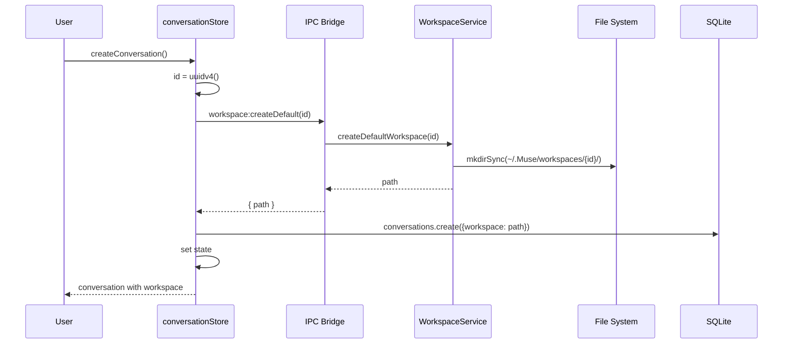
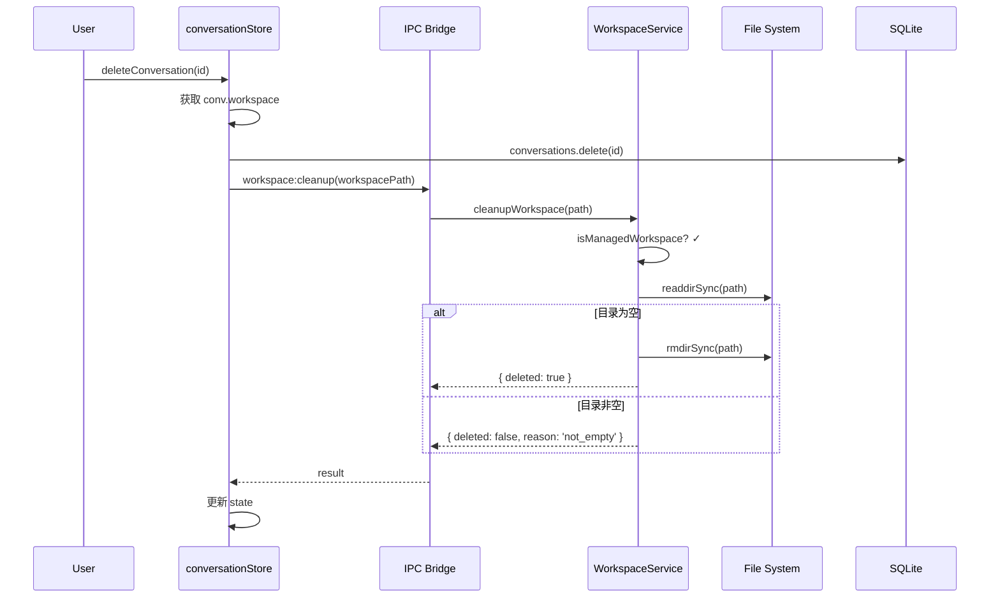

# 详细设计: 工作区管理优化

> 日期: 2026-02-11
> 优先级: P0
> PRD 来源: docs/2026-02-11-token-context-workspace-prd.md (功能四)

---

## 1. 概述

优化工作区管理，解决两个问题:
1. **新对话无默认工作区** — 新建对话时自动创建 `~/.Muse/workspaces/{conv-id}/` 目录并绑定
2. **孤立目录无清理** — 对话删除时清理关联工作区目录，应用启动时扫描孤立目录

---

## 2. 现状分析

### 2.1 已有能力

- `workspaceStore.ts`: 全局工作区选择（`workspacePath`）
- `conversations` 表: `workspace` 字段（nullable）
- `conversationStore.ts`: `setWorkspace()` 方法
- `getEffectiveWorkspace()`: 优先使用对话级 workspace，fallback 到全局 workspace
- `FileSystemService`: `getWorkspace()` / `setWorkspace()` 方法

### 2.2 缺失能力

- 新对话创建时不设置默认 workspace
- 对话删除时不清理 workspace 目录
- 无孤立目录检测和清理机制

---

## 3. 目录结构设计

```
~/.Muse/
  workspaces/
    {conversation-id-1}/    ← 对话1的默认工作区
    {conversation-id-2}/    ← 对话2的默认工作区
```

**基础路径常量**:

```typescript
// src/shared/constants/paths.ts (新增)
import { homedir } from 'os'
import { join } from 'path'

export const MUSE_HOME = join(homedir(), '.Muse')
export const WORKSPACES_DIR = join(MUSE_HOME, 'workspaces')
```

> 注: 前端无法直接使用 `os.homedir()`，需通过 IPC 获取路径。

---

## 4. 新对话自动创建默认工作区

### 4.1 WorkspaceService（新增）

**文件**: `src/main/services/workspaceService.ts`

```typescript
import { existsSync, mkdirSync, readdirSync, rmdirSync, rmSync } from 'fs'
import { join } from 'path'
import { homedir } from 'os'

const MUSE_HOME = join(homedir(), '.Muse')
const WORKSPACES_DIR = join(MUSE_HOME, 'workspaces')

export class WorkspaceService {
  /**
   * 确保 workspaces 根目录存在
   */
  static ensureWorkspacesDir(): void {
    if (!existsSync(WORKSPACES_DIR)) {
      mkdirSync(WORKSPACES_DIR, { recursive: true })
    }
  }

  /**
   * 为对话创建默认工作区目录
   */
  static createDefaultWorkspace(conversationId: string): string {
    this.ensureWorkspacesDir()
    const workspacePath = join(WORKSPACES_DIR, conversationId)
    if (!existsSync(workspacePath)) {
      mkdirSync(workspacePath, { recursive: true })
    }
    return workspacePath
  }

  /**
   * 检查路径是否为 Muse 管理的工作区
   */
  static isManagedWorkspace(path: string): boolean {
    return path.startsWith(WORKSPACES_DIR)
  }

  /**
   * 清理对话关联的工作区目录
   */
  static cleanupWorkspace(
    workspacePath: string
  ): { deleted: boolean; reason: string } {
    if (!this.isManagedWorkspace(workspacePath)) {
      return { deleted: false, reason: 'not_managed' }
    }
    if (!existsSync(workspacePath)) {
      return { deleted: false, reason: 'not_found' }
    }
    const entries = readdirSync(workspacePath)
    if (entries.length === 0) {
      rmdirSync(workspacePath)
      return { deleted: true, reason: 'empty' }
    }
    // 非空目录不自动删除
    return { deleted: false, reason: 'not_empty' }
  }

  /**
   * 扫描孤立工作区目录
   */
  static getOrphanedWorkspaces(
    activeConversationIds: string[]
  ): Array<{ path: string; id: string; isEmpty: boolean }> {
    this.ensureWorkspacesDir()
    const activeSet = new Set(activeConversationIds)
    const entries = readdirSync(WORKSPACES_DIR, { withFileTypes: true })
    const orphans: Array<{ path: string; id: string; isEmpty: boolean }> = []

    for (const entry of entries) {
      if (entry.isDirectory() && !activeSet.has(entry.name)) {
        const fullPath = join(WORKSPACES_DIR, entry.name)
        const contents = readdirSync(fullPath)
        orphans.push({
          path: fullPath,
          id: entry.name,
          isEmpty: contents.length === 0,
        })
      }
    }
    return orphans
  }

  /**
   * 删除指定工作区目录（递归）
   */
  static forceDeleteWorkspace(workspacePath: string): boolean {
    if (!this.isManagedWorkspace(workspacePath)) return false
    if (!existsSync(workspacePath)) return false
    rmSync(workspacePath, { recursive: true, force: true })
    return true
  }
}
```

### 4.2 IPC Handlers（新增）

**文件**: `src/main/index.ts`

```typescript
// 新增 IPC handlers:

ipcMain.handle('workspace:createDefault', async (_, { conversationId }) => {
  const path = WorkspaceService.createDefaultWorkspace(conversationId)
  return { path }
})

ipcMain.handle('workspace:cleanup', async (_, { workspacePath }) => {
  return WorkspaceService.cleanupWorkspace(workspacePath)
})

ipcMain.handle('workspace:cleanupOrphans', async () => {
  const conversations = await ConversationService.getAll()
  const activeIds = conversations.map((c: any) => c.id)
  const orphans = WorkspaceService.getOrphanedWorkspaces(activeIds)

  // 自动删除空目录
  let deletedCount = 0
  const nonEmpty: typeof orphans = []
  for (const orphan of orphans) {
    if (orphan.isEmpty) {
      WorkspaceService.forceDeleteWorkspace(orphan.path)
      deletedCount++
    } else {
      nonEmpty.push(orphan)
    }
  }
  return { deletedCount, nonEmpty }
})

ipcMain.handle('workspace:forceDelete', async (_, { path }) => {
  return { deleted: WorkspaceService.forceDeleteWorkspace(path) }
})
```

### 4.3 Preload Script 扩展

**文件**: `src/preload/index.ts`

```typescript
// workspace 对象中新增:
workspace: {
  // ... 现有方法 ...
  createDefault: (conversationId: string) =>
    ipcRenderer.invoke('workspace:createDefault', { conversationId }),
  cleanup: (workspacePath: string) =>
    ipcRenderer.invoke('workspace:cleanup', { workspacePath }),
  cleanupOrphans: () =>
    ipcRenderer.invoke('workspace:cleanupOrphans'),
  forceDelete: (path: string) =>
    ipcRenderer.invoke('workspace:forceDelete', { path }),
}
```

### 4.4 conversationStore.ts — createConversation 改动

**文件**: `src/renderer/src/stores/conversationStore.ts`

```typescript
createConversation: async (title = 'New Chat') => {
  const newConversation: Conversation = {
    id: uuidv4(),
    title,
    createdAt: Date.now(),
    updatedAt: Date.now(),
    messages: [],
  }

  // 创建默认工作区目录
  const { path: workspacePath } = await window.api.workspace.createDefault(
    newConversation.id
  )

  // 绑定工作区
  newConversation.workspace = workspacePath

  // Save to database (含 workspace)
  await dbClient.conversations.create({
    id: newConversation.id,
    title: newConversation.title,
    createdAt: new Date(newConversation.createdAt),
    updatedAt: new Date(newConversation.updatedAt),
    workspace: workspacePath,
  })

  set((state) => ({
    conversations: [newConversation, ...state.conversations],
    currentConversationId: newConversation.id,
  }))

  return newConversation
},
```

---

## 5. 对话删除时清理工作区

### 5.1 conversationStore.ts — deleteConversation 改动

**文件**: `src/renderer/src/stores/conversationStore.ts`

```typescript
deleteConversation: async (id: string) => {
  // 获取对话信息（用于清理工作区）
  const conv = get().conversations.find((c) => c.id === id)
  const workspacePath = conv?.workspace

  // Delete from database
  await dbClient.conversations.delete(id)

  // 清理 Muse 管理的工作区目录
  if (workspacePath) {
    try {
      const result = await window.api.workspace.cleanup(workspacePath)
      if (!result.deleted && result.reason === 'not_empty') {
        console.log(`Workspace ${workspacePath} not empty, skipping cleanup`)
        // 非空目录不自动删除，仅记录日志
      }
    } catch (error) {
      console.error('Failed to cleanup workspace:', error)
    }
  }

  set((state) => {
    const newConversations = state.conversations.filter((c) => c.id !== id)
    const newCurrentId =
      state.currentConversationId === id
        ? newConversations[0]?.id || null
        : state.currentConversationId
    return { conversations: newConversations, currentConversationId: newCurrentId }
  })
},
```

---

## 6. 应用启动时孤立目录清理

### 6.1 启动清理流程

**文件**: `src/renderer/src/App.tsx`（或应用初始化入口）

在应用启动、conversations 加载完成后，调用孤立目录清理:

```typescript
// App 初始化时:
useEffect(() => {
  async function init() {
    await conversationStore.loadConversations()
    // 启动时清理孤立工作区
    try {
      const result = await window.api.workspace.cleanupOrphans()
      if (result.deletedCount > 0) {
        console.log(`Cleaned up ${result.deletedCount} orphaned workspace(s)`)
      }
      if (result.nonEmpty.length > 0) {
        console.warn('Non-empty orphaned workspaces:', result.nonEmpty)
      }
    } catch (error) {
      console.error('Failed to cleanup orphaned workspaces:', error)
    }
  }
  init()
}, [])
```

---

## 7. 需要修改的文件清单

| 文件 | 改动类型 | 描述 |
|------|---------|------|
| `src/main/services/workspaceService.ts` | **新增** | 工作区目录管理服务 |
| `src/main/index.ts` | 修改 | 新增 4 个 workspace IPC handlers |
| `src/preload/index.ts` | 修改 | 暴露新 workspace API |
| `src/renderer/src/stores/conversationStore.ts` | 修改 | createConversation 自动创建工作区，deleteConversation 清理工作区 |
| `src/renderer/src/App.tsx` | 修改 | 启动时调用孤立目录清理 |

---

## 8. 时序图

### 8.1 新对话创建 — 自动绑定工作区



### 8.2 对话删除 — 工作区清理



---

## 9. BDD 验收标准

### 9.1 新对话自动创建默认工作区

```gherkin
Feature: 新对话自动创建默认工作区

  Scenario: 创建新对话时自动绑定工作区
    Given 用户已打开 Muse 应用
    When 用户点击 "New Chat" 创建新对话
    Then 应在 ~/.Muse/workspaces/{conversation-id}/ 下创建目录
    And 该对话的 workspace 字段应设置为该目录路径
    And WorkspaceDropdown 应显示该默认工作区路径

  Scenario: 用户可切换到其他工作区
    Given 新对话已自动绑定默认工作区
    When 用户通过 WorkspaceDropdown 选择其他目录
    Then 对话的 workspace 应更新为用户选择的目录
    And 默认工作区目录保留不删除
```

### 9.2 对话删除时清理工作区

```gherkin
Feature: 对话删除时清理关联工作区

  Scenario: 删除对话时清理空的默认工作区
    Given 存在一个对话，其 workspace 指向 ~/.Muse/workspaces/{id}/
    And 该目录为空
    When 用户删除该对话
    Then 该空目录应被自动删除

  Scenario: 删除对话时保留非空工作区
    Given 存在一个对话，其 workspace 指向 ~/.Muse/workspaces/{id}/
    And 该目录包含用户文件
    When 用户删除该对话
    Then 该目录不应被删除
    And 控制台应记录日志提示目录非空

  Scenario: 删除对话时不清理用户自选工作区
    Given 存在一个对话，其 workspace 指向 /Users/x/projects/myapp
    When 用户删除该对话
    Then 不应尝试删除 /Users/x/projects/myapp 目录
```

### 9.3 应用启动时孤立目录清理

```gherkin
Feature: 应用启动时清理孤立工作区目录

  Scenario: 启动时自动删除空的孤立目录
    Given ~/.Muse/workspaces/ 下存在目录 {old-id}/
    And conversations 表中不存在 id 为 {old-id} 的对话
    And 该目录为空
    When 应用启动并完成初始化
    Then 该空目录应被自动删除

  Scenario: 启动时保留非空孤立目录
    Given ~/.Muse/workspaces/ 下存在目录 {old-id}/
    And conversations 表中不存在 id 为 {old-id} 的对话
    And 该目录包含文件
    When 应用启动并完成初始化
    Then 该目录不应被删除
    And 控制台应记录警告信息
```

---

## 10. 边界情况与安全考虑

1. **安全边界**: `isManagedWorkspace()` 确保只清理 `~/.Muse/workspaces/` 下的目录，绝不删除用户自选的外部工作区
2. **并发创建**: 多次快速创建对话时，`mkdirSync({ recursive: true })` 保证幂等性
3. **权限问题**: 如果 `~/.Muse/` 目录无写权限，`createDefaultWorkspace` 会抛异常，前端 catch 后降级为无默认工作区
4. **磁盘空间**: 空目录占用极少空间，启动清理为尽力而为，失败不影响应用正常运行

---

## 11. 测试要点

1. **WorkspaceService 单元测试**: 测试 createDefaultWorkspace、cleanupWorkspace、getOrphanedWorkspaces
2. **安全测试**: 验证 isManagedWorkspace 正确拒绝外部路径
3. **集成测试**: 创建对话 → 验证目录存在 → 删除对话 → 验证目录清理
4. **启动清理测试**: 模拟孤立目录场景，验证空目录删除、非空目录保留
